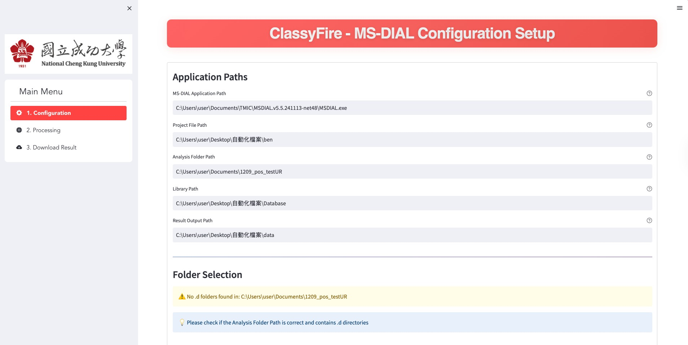
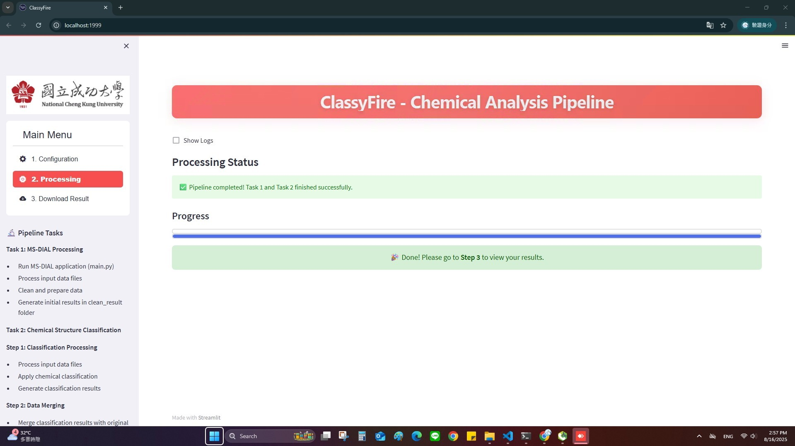
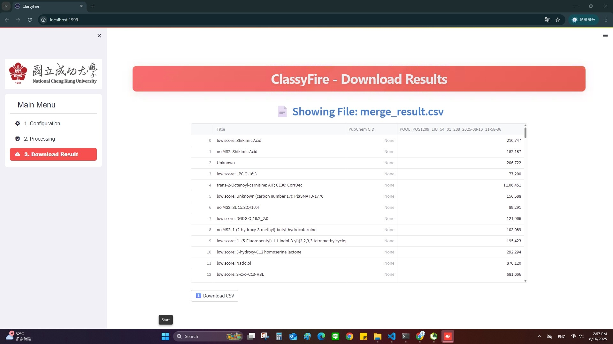

# NCKU_ClassyFire_Project

## Overview
NCKU_ClassyFire_Project provides a pipeline and web interface to process and classify MS-Dial outputs. This repository contains scripts, configuration, and a user-friendly interface to streamline your analysis workflow.  

---

## Step 1: Install Libraries

Open **CMD** window and install the following required libraries:

```bash
pip install pywinauto pyperclip pyautogui pywin32
````

After installation, restart your environment to ensure everything is applied correctly.

---

## Step 2: Configure MS-Dial Paths

Before running, you need to set the correct paths:

* **`app_path`**: Path to MS-DIAL executable
* **`project_file_path`**: Location to save your MS-Dial project file (see Slide 3–4)
* **`folder_analysis_path`**: Folder containing input files for processing (see Slide 5)
* **`folders_to_select`**: The input folders you want to process

⚠️ **Note**: Double-check that the selected files/folders are correct before applying them on your system.

---

## Step 3: Install Dependencies

If you want to install all dependencies at once:

```bash
pip install -r requirements.txt
```

---

## Step 4: Start the App

You can launch the web interface with either of the following:

```bash
bash runapp.sh
```

or

```bash
streamlit run app.py --server.port 1999
```

---

# NCKU_ClassyFire Website Instructions

The website provides a **3-step workflow**, accessible from the **left-hand sidebar**:

### 1. Configuration

* Go to **Step 1 (Configuration)**.
* Set up your parameters as needed.
* After finishing, **save the configuration** and **double-check** your settings.

👉 Figure 1:


---

### 2. Processing

* Navigate to **Step 2 (Processing)**.
* Click the **Run** button to start the process.
* Please wait until you see the notification:
  **“Done! Please go to Step 3 to view your results.”**

👉 Figure 2:



---

### 3. Download

* Finally, go to **Step 3 (Download)**.
* Click **Download Result** to view and save your results.

👉 Figure 3:


---

## Notes

* Ensure correct paths and configurations before running the pipeline.
* For troubleshooting, check logs and verify dependencies are installed properly.

---

```
```
